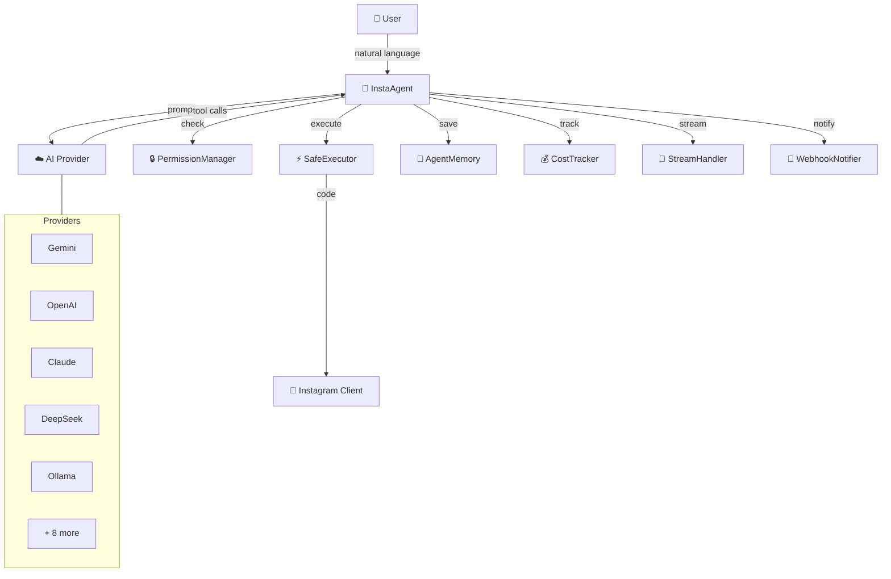
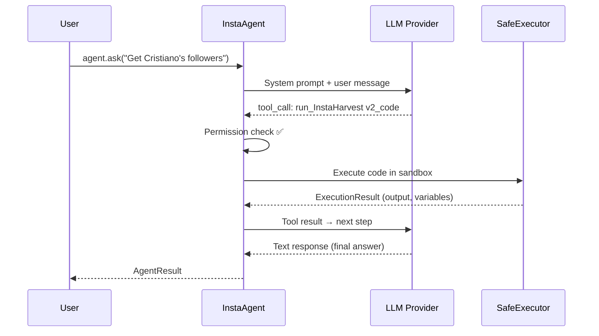

# Architecture

## System Overview



## Module Map

| Module | Class | Purpose |
| --- | --- | --- |
| `core.py` | `InstaAgent` | Main agent — LLM loop, tool dispatch |
| `coordinator.py` | `AgentCoordinator` | Multi-agent parallel/sequential |
| `executor.py` | `SafeExecutor` | Sandboxed code execution |
| `permissions.py` | `PermissionManager` | 3-level permission control |
| `memory.py` | `AgentMemory` | Session persistence (JSON) |
| `cost_tracker.py` | `CostTracker` | Token usage & cost monitoring |
| `streaming.py` | `StreamHandler` | Real-time output (CLI/Web/callback) |
| `plugins.py` | `PluginManager` | Custom tool registration |
| `vision.py` | `VisionAnalyzer` | Image analysis (multimodal) |
| `webhook.py` | `WebhookNotifier` | Telegram/Discord/Email notifications |
| `scheduler.py` | `AgentScheduler` | Cron-like task scheduling |
| `tools/` | `TOOL_HANDLERS` | 161 built-in tool implementations across 10 modules |
| `knowledge.py` | `SYSTEM_PROMPT` | Full InstaHarvest v2 knowledge base |
| `providers/` | `BaseProvider` | 14 AI provider adapters |
| `cli.py` | `main()` | Terminal interface |
| `web.py` | `create_app()` | FastAPI web UI |

## Agent Loop



**Max steps**: default 15 iterations. Agent stops when LLM responds without tool calls or limit is reached.

## Security Model

`SafeExecutor` provides sandboxed code execution:

- ✅ **Whitelisted imports only**: `json`, `csv`, `datetime`, `math`, `re`, `collections`, `statistics`, `InstaHarvest v2`
- ❌ **Blocked**: `subprocess`, `os.system`, `eval`, `exec`, `socket`, `ctypes`, `pickle.loads`
- 🔒 **File access**: Read/write only in current directory
- ⏱️ **Timeout**: Configurable (default 30s)
- 🛡️ **Code validation**: Static analysis before execution

```python
# Blocked patterns — auto-rejected
BLOCKED = [
    "subprocess", "os.system", "os.popen",
    "__import__", "eval(", "exec(",
    "open(/",      # absolute paths
    "socket.", "http.server", "ctypes",
    "sys.exit", "quit()", "exit()",
]
```

## Data Flow

```text
User Message
    ↓
InstaAgent.ask()
    ↓
_build_mode_info()     → detect sync/async/anon mode
    ↓
Provider.generate()    → send to LLM
    ↓
_agent_loop()          → iterate until done
    ├── PermissionManager.check()
    ├── SafeExecutor.run()       → sandboxed code
    ├── TOOL_HANDLERS[name]()    → built-in tools
    ├── PluginManager.execute()  → custom tools
    ├── StreamHandler.on_*()     → real-time output
    └── CostTracker.record()     → track usage
    ↓
AgentResult(answer, code, files, steps, tokens, duration)
```
