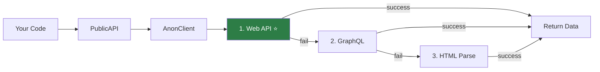

# Anonymous Scraping — Overview

InstaHarvest v2's anonymous scraping system can access public Instagram data **without login** using a configurable fallback strategy chain.

## How It Works



Default order: **Web API** (richest data) → **GraphQL** → **HTML Parse** (minimal).
If one strategy fails (rate limited, blocked, etc.), it automatically tries the next one.

## Configurable Strategy Chain ⚡

You can **customize** the strategy order:

```python
from instaharvest_v2 import Instagram, ProfileStrategy, PostsStrategy

# Default — web_api first (best data):
ig = Instagram.anonymous()

# Custom order — try HTML first, then Web API:
ig = Instagram.anonymous(
    profile_strategies=["html_parse", "web_api"],
    posts_strategies=["mobile_feed", "web_api"],
)

# Use only one strategy:
ig = Instagram.anonymous(
    profile_strategies=["web_api"],
)
```

### Profile Strategies

| Strategy | Enum | Data Richness |
|---|---|---|
| **Web API** | `ProfileStrategy.WEB_API` | ⭐⭐⭐ bio_links, category, business_email |
| **GraphQL** | `ProfileStrategy.GRAPHQL` | ⭐⭐ followers, bio, posts_count |
| **HTML Parse** | `ProfileStrategy.HTML_PARSE` | ⭐ followers, short bio only |

### Posts Strategies

| Strategy | Enum | Description |
|---|---|---|
| **Web API** | `PostsStrategy.WEB_API` | 12 posts from web_profile_info |
| **HTML Parse** | `PostsStrategy.HTML_PARSE` | Embedded posts from HTML page |
| **GraphQL** | `PostsStrategy.GRAPHQL` | GraphQL query (needs user_id) |
| **Mobile Feed** | `PostsStrategy.MOBILE_FEED` | Rich data: video_url, location |

## Available Data (No Login)

| Data Type | Method | Works? |
|---|---|---|
| Profile info | `get_profile()` | ✅ |
| Posts (12) | `get_posts()` | ✅ |
| Post by URL | `get_post_by_url()` | ✅ |
| Post comments | `get_comments()` | ✅ |
| Media URLs | `get_media_urls()` | ✅ |
| Search | `search()` | ✅ |
| Reels | `get_reels()` | ✅ |
| Mobile feed | `get_feed()` | ✅ |
| All posts (paginated) | `get_all_posts()` | ✅ |
| Hashtag posts | `get_hashtag_posts()` | ✅ |
| Location posts | `get_location_posts()` | ✅ |
| Similar accounts | `get_similar_accounts()` | ✅ |
| Highlights | `get_highlights()` | ✅ |
| Stories | ❌ | Login required |
| Followers/Following | ❌ | Login required |
| DM | ❌ | Login required |

## Quick Example

```python
from instaharvest_v2 import Instagram

ig = Instagram.anonymous()

# Profile
profile = ig.public.get_profile("cristiano")
print(f"@{profile['username']}: {profile['followers']:,} followers")
print(f"Strategy used: {profile['_strategy']}")  # web_api, graphql, or html_parse

# Posts
posts = ig.public.get_posts("cristiano")
for post in posts[:3]:
    print(f"  ❤️ {post['likes']:,}  💬 {post['comments']}")

# Search
results = ig.public.search("fashion")
for user in results["users"][:3]:
    print(f"  @{user['username']}")
```

## Two API Levels

| Level | Class | For |
|---|---|---|
| **High-level** | `PublicAPI` / `AsyncPublicAPI` | Easy, clean interface |
| **Low-level** | `AnonClient` / `AsyncAnonClient` | Direct endpoint access |

```python
# High-level (recommended)
profile = ig.public.get_profile("nike")

# Low-level (more control)
raw = ig._anon_client.get_web_profile("nike")
```
